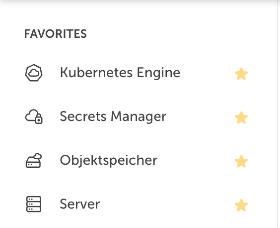

# STACKIT Portal Efficiency
hey :)
this is a little tampermonkey script, to add some functionalities on top of the STACKIT Portal.
Please don't judge the code, it's partly Gemini and partly i have no clue.

## features

### favorites


## install - the easy way

click the __[link](https://raw.githubusercontent.com/bym0/stackit-portal-efficiency/refs/heads/main/src/userscript.user.js)__ to install the script (tampermonkey or greasemonkey has to be installed)

## install - also easy but not recommended

not recommended: Include the following in your tampermonkey as a userscript

```javascript
// ==UserScript==
// @name         STACKIT Portal Efficiency
// @namespace    http://tampermonkey.net/
// @version      1.0
// @description  Adds efficient functions to the STACKIT Portal
// @author       Timo Bergen
// @match        https://portal.stackit.cloud/*
// @icon         https://www.google.com/s2/favicons?sz=64&domain=stackit.cloud
// @grant        GM_getValue
// @grant        GM_setValue
// @require      https://raw.githubusercontent.com/bym0/stackit-portal-efficiency/refs/heads/main/src/main.js
// ==/UserScript==
```